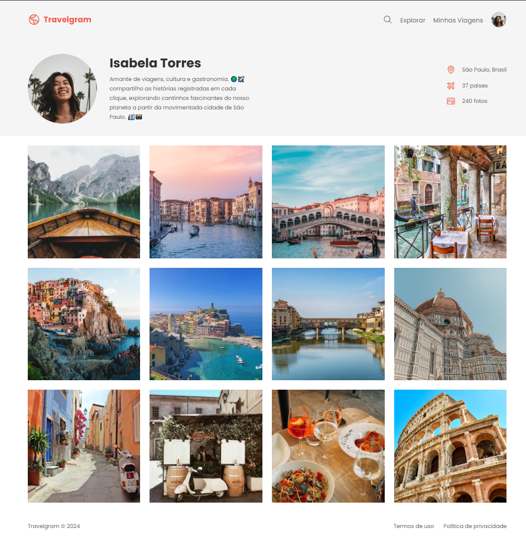

# Travelgram

Projeto de estudo front-end que reproduz uma página de perfil estilo rede social voltada para viagens, com header de navegação, seção de perfil e um feed de fotos em grid.



## ✨ Funcionalidades

- Header com logo, busca, navegação e avatar do usuário
- Seção de perfil com foto, nome, bio e estatísticas (localização, países visitados, fotos)
- Feed de fotos em grid responsivo
- Footer com links institucionais

## 🚀 Tecnologias

- HTML5
- CSS3 (Flexbox)
- [Google Fonts](https://fonts.google.com/) (Poppins)

## 📁 Estrutura do projeto

```
travelgram/
├── index.html
├── assets/
│   ├── icons/
│   ├── img/
│   ├── Logo.svg
│   └── Profilepic.png
└── styles/
    ├── index.css        # importa os demais arquivos de estilo
    ├── global.css        # reset, variáveis e classe .container
    ├── nav.css
    ├── sectionProfile.css
    ├── main.css
    └── footer.css
```

## 💻 Como rodar

Este é um projeto estático (sem dependências ou build), então basta:

1. Clonar o repositório
   ```bash
   git clone https://github.com/RafaelJuniorM/travelgram.git
   ```
2. Abrir o arquivo `index.html` no navegador — ou usar a extensão [Live Server](https://marketplace.visualstudio.com/items?itemName=ritwickdey.LiveServer) do VSCode para recarregamento automático.

## 👤 Autor

Feito por [Rafael Junior Martins](https://github.com/RafaelJuniorM).
